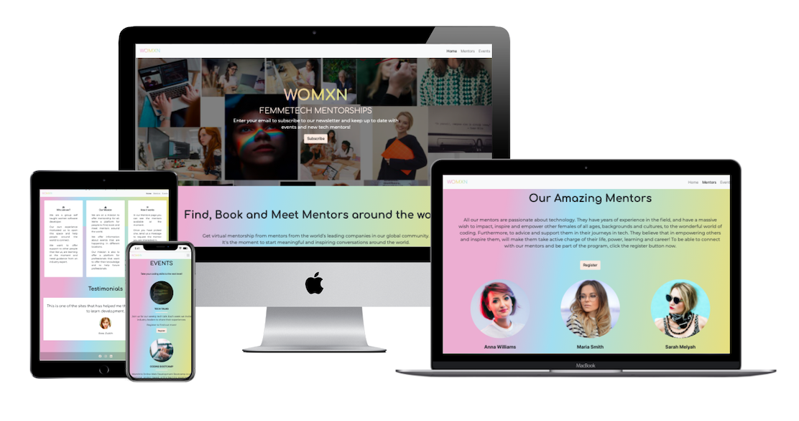

# WOMXN Femmetech Mentorships

# Introduction

This project was created for Code Institute's first-ever #women-in-tech Hackathon.

We decided to join this event to inspire, connect and grow with Code Institute's Women in Tech community.
Each of us has different coding experience, as we are on different levels and from different countries. However, we wanted to work together to create this incredible page. We became a "small coding family" and this friendly atmosphere allowed us to have lots of fun with this project. 

We decided to create a webpage that will help other women gather some information from our female mentors about what IT means today, what the IT sector can offer to women, and which path could be the best for each of our visitors and why. 

A deployed link to the website can be found **[here](https://carolinacobo.github.io/womxn-femmetech-mentorship/index.html)**.

# User Experience (UX)

This page was created for women, of all ages, cultures and backgrounds. Some of them:
- Could try to come back to work after a long stay at home with their children (or for any other reason),
- Are not very happy in their own working lives, and want to switch to a different role, especially in the tech industry,
- Want to build a new career in IT and use their previous work and life experiences in the new role,
- Want to upskill their knowledge in new technologies,
- Develop own skills to higher level and become a pro in a specific field in IT. 
- Are young girls trying to learn more about the coding and tech world, and the knowledge and tools to get there.  

## First time Visitor's needs:

- Know more about our WomXn page, 
- Read about inspiring women in TECH community,
- Read a little more about possible paths in IT,
- Easily navigate through the whole website,
- Find contact details,
- Find our social media links.

## Returning visitors are very often interested in:

- New mentors,
- Upcoming events,
- New hackathons,
- Following WomXn on our social media,
- Receiving our newsletter with up to date information. 

# Design

## Global 

This page is created by women for women. We decided to use pastel colors, which we choose in a democratic way:)

## Color Scheme
 
 For good contrast all text on our site (even headings) are black.
 Our main background colours in RGBA are :
  - 225, 180, 211 (pink),
  - 174,211, 239 (yellow),
  - 234, 211,128 (blue).
 

## Typography
In our project we decided to use Comforteaa (for headings) and Monteserrat (for paragraphs) taken from Google Fonts.

## Imagery

It's important for this page, as it improves the user experience. 

## Wireframes

Wireframes for this project are available [here]("/asssets/wireframes/wireframes.pdf")
# Features

To keep a consistent layout we decided to keep the same navbar and footer on all of our subpages, these are: Home, Mentors and Events.

## Home page

This page was inspired by the Netflix page. We wanted it to have a similar effect, which we achived. We have only limited data here, with the mentor and events pages in the navbar and our social media links in the footer. At the center of the home page, on the hero image, there is a call to action button which allows our users to register to our newsletter.   

## Mentors page

Here are presented womXn mentors who are passionate about technology. Our visitors can read more about backgrounds and cultures, their work and paths which they have chosen. They also can register to get access to be able to connect with our mentors and be part of the program provided by womXn. 

## Events page 

This is the "cream de la cream" in our projects. Here our visitors:
-  can join us for our weekly tech talks (in section TECH TALKS),
-  improve their own skills in our WomXn's Online Web Development Bootcamp, available in CODING BOOTCAMP section, 
- or work during WOMXN HACKATHON which is an intensive event where our users will be presented with a problem and will have 5 days to come up with a really good solution.

# Technologies Used

 - HTML5
 - CSS3 
 - JavaScript

 # Testing

## User Stories testing

In our opinion, this project covers all users needs descibed in the section above.

## Links

All links working fine, just like we wanted.

## Responsive Design

Yes, our page is responsive :)

## Validators
 
To validate this project we used:

1. [HTML validator](https://validator.w3.org/)
2. [CSS validator](https://jigsaw.w3.org/css-validator/)
3. [JS validator](https://jshint.com/)

## Bowser Compatitbility

Our project works fine on different browsers. It was tesed on :

- Google Chrom 
- Mozilla
- Opera

## Grammar and spelling

Was made, as well.

## Lighthouse

- Performance 70
- Accesibility 97
- Best practis 93
- SEO 83

# Deployment

## Github

To deploy this page to GitHub Pages from its GitHub repository, the following steps were taken:
1. log into GitHub.
2. From the list of repositories on the screen, select madatoo/ms2-sligo
3. From the menu items near the top of the page, select Settings.
4. Scroll down to the GitHub Pages section.
5. Under Source click the drop-down menu labelled None and select Master Branch
6. On selecting Master Branch the page is automatically refreshed, the website is now deployed.
7. Scroll back down to the GitHub Pages section to retrieve the link to the deployed website.

Run this project locally (clone this project into Gitpod) you will need:

- a Github account. Create a Github account here
- use the browser with extention for gitpod Then follow these steps:

1. Install the Gitpod Browser Extentions for your browser
2. After installation, restart the browser
3. Log into Gitpod with your gitpod account.
4. Navigate to the Project GitHub repository
5. Click the green "Gitpod" button in the top right corner of the respository
6. This will trigger a new gitpod workspace to be created from the code in github where you can work locally.

# Credits

## Content 
 
Content was created by us. We were looking at similar pages to get some ideas about how this page should look like. Below we listed some from our main sources in this project. Feel free to get some inspiration from us :)

## Images

1. Images are taken from :

- [This Persondoes Not Exist](https://thispersondoesnotexist.com/)
- [Unsplash](https://unsplash.com/)
- [Fairygodboss.com](https://fairygodboss.com/career-topics/strong-woman-meme)
- [Pinterest](https://www.pinterest.ie/pin/714172453411130542/)

2. Colors inspirations: 

- [Pinterest](https://www.pinterest.ie/pin/802133383617190843/)
- [Shutterstock Pastel Palettes](https://www.shutterstock.com/blog/pastel-color-palettes-rococo-trend?customer_ID=356331[…]sletter_2019-05-23&launch_ID=18556185&utm_source=sstkemail)
- [Shutterstock Retro Palettes](https://www.shutterstock.com/blog/25-free-retro-color-palettes )

3. Font inspirations:

 - [Pinterest](https://www.pinterest.ie/pin/326792516717093186/)
 - [Fontspace](https://www.fontspace.com/category/feminine?p=4)
 - [Shutterstock](https://www.shutterstock.com/blog/top-free-fonts-designers)

4. Layout inspirations:

- [Mentor](https://www.mentoring.org/)
- [Adplist](https://adplist.org/)

# Acknowledgements

1. Code Institute for an opportunity to meet, have fun, build a community #women-in-tech and allowing us to work together to build this page.

2. Our mentor Jim_Lynx 

3.  All team members:
- Carolina Cobo, 
- Elrie, 
- Joan Amudu, 
- Magdalena Ruszaj,
- Vanja

# Disclaimer

Content on this page is created only for first #women-in-tech Hackathon in Code Institute. 

